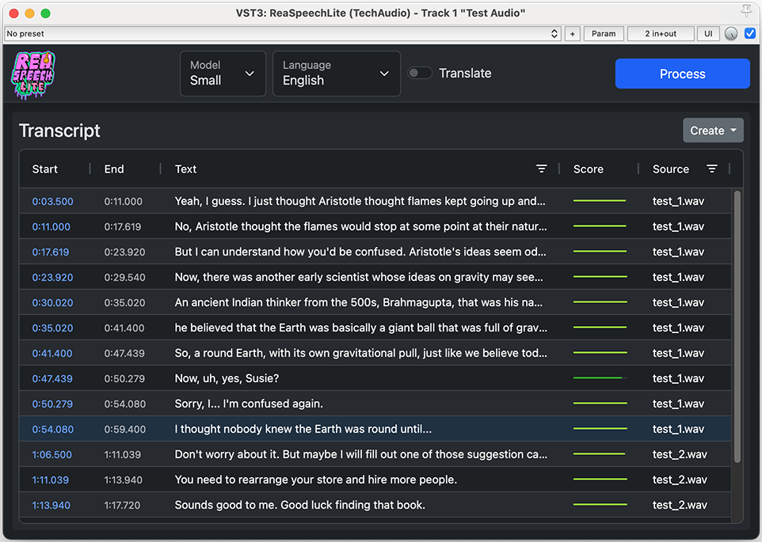

# ReaSpeech Lite

### Speech-to-text transcription for REAPER as a VST3/ARA plugin

ReaSpeech Lite is an open-source plugin for REAPER that does speech-to-text
transcription. If you add it to one or more tracks and click the "Process"
button, it will transcribe the speech on those tracks and display the results
in a table. You can use the table to quickly navigate your project with
searching, filtering, and sorting features. The transcript is saved with your
project, and can additionally be used to create markers, regions, or tracks
containing text notes.

> [!WARNING]
> Please note that this plugin is experimental. Though we strive for reliability, it may crash (taking REAPER down with it) or otherwise cause issues opening your project. We strongly recommend that you back up your REAPER project files before adding this plugin.

## Installation

### Windows

For Windows users, it is highly recommended to use the CUDA version if
possible, as it has a significant impact on processing speed. To use the CUDA
version, you will need an NVIDIA graphics card, and you will need to install
the CUDA Toolkit.

* Get the CUDA Toolkit here: [CUDA Toolkit Downloads](https://developer.nvidia.com/cuda-downloads)
* Download the WindowsCUDA installer here: [Latest Release](https://github.com/TeamAudio/reaspeech-lite/releases/latest)

If you do not have an NVIDIA card, or do not want to install CUDA Toolkit, you
can download the non-CUDA version instead.

> [!IMPORTANT]
> Please note that our installer is not currently code-signed, so Windows may display a warning dialog when you run it. To complete the installation, you will need to click on the "More info" link, and then the "Run Anyway" button.

### Mac

For Mac users, you do not need to download or install anything extra. If you
are using Apple Silicon (M1 or newer), ReaSpeech Lite should be able to use
the Metal framework for GPU acceleration.

* Download the macOS installer here: [Latest Release](https://github.com/TeamAudio/reaspeech-lite/releases/latest)

> [!IMPORTANT]
> Please note that our installer is not currently code-signed, so macOS may display a warning dialog when you run it. To complete the installation, you will need to go to Settings > Security & Privacy and click the "Allow Anyway" button.

### Linux

A CUDA version is also available for Linux. Depending on your Linux
distribution, you may be able to download it using your package manager with a
command like:

    sudo apt install cuda-toolkit

Alternatively, you can [download the CUDA Toolkit](https://developer.nvidia.com/cuda-downloads) from NVIDIA.

* Download the Linux or LinuxCUDA installer here: [Latest Release](https://github.com/TeamAudio/reaspeech-lite/releases/latest)

## Usage

To use the plugin in REAPER, add it to a track by clicking the "FX" button and
selecting ReaSpeechLite. You can search for the plugin by name, or browse for it
under the "VST3" section.

> [!IMPORTANT]
> If you do not see ReaSpeechLite in the list of plugins, there may be an issue with the installation. Please make sure that ReaSpeechLite.vst3 can be found at one of REAPER's plugin paths, configurable at Reaper > Options > Preferences > Plug-ins > VST. If the plugin still does not show up, and you are trying to use the CUDA version, please ensure that you have installed CUDA Toolkit.

Once you have successfully added the plugin to a track, click the blue
"Process" button, and ReaSpeech Lite will begin processing all of the source
audio on the track. If desired, you can add the plugin to multiple tracks, and
it will run on all audio found on the tracks that include the plugin.

Once the processing is complete, you should see a table of all the detected
speech, and you can use this table to navigate the speech in your project.
Clicking on a timestamp or line of speech text will automatically play from
the position where this speech occurs.

### Options

There are a few options you can select to customize the speech recognition process.

Model:

* Small - Fastest, but may be inaccurate depending on the source audio
* Medium - Slower, but more accurate
* Large - Slowest, but most accurate
* Turbo - Faster than Large, but with similar accuracy (Large v3 Turbo)

Language:

* Detect - Attempt to detect the language in the source audio
* Specific language - Manually override the language

Translate:

* Checked - Translate the speech to English
* Unchecked - Leave the speech in its original language

### Saving Transcripts

The transcript will be saved along with your project. The next time you open
the project, you should see the transcript when the plugin is visible.

In addition, the transcript can be written to the REAPER project in various
ways by using the Create button. There are three options:

* Markers - Create project markers
* Regions - Create project regions
* Notes - Create a track with notes items

Once written to the project in this way, you can remove the plugin
from the project if you desire.

## Features

ReaSpeech Lite is a simple tool that aims to have a minimal but powerful
feature set. The following features are currently available:

### Transcription with whisper.cpp

- Transcription using Small, Medium, Large, and Large v3 Turbo models
- Automatic download of models
- Language detection with manual override
- Optional translation to English

### Browsing results

- Efficient results table that can scale to large transcripts
- Searching, filtering, and sorting of results
- Navigation and auto-play of project by clicking text links
- Automatic adjustment of timestamps in response to media item edits (splitting, cropping, moving)
- Display of colorized, graphical confidence scores to help determine the accuracy of the results

### Persistence

- Saves transcripts and other settings when project is saved
- Creates markers, regions, and notes tracks in REAPER project

### Compatibility

- Compatible with Mac, Windows, and Linux
- GPU acceleration available on all supported platforms
- Built as a VST3 with ARA 2.0, enabling possible use outside of REAPER (e.g. Cubase)

## Development

### Building ReaSpeech Lite

To build ReaSpeech Lite from source, check out the git repository, and run the following command to initialize it:

    git submodule update --init --recursive

You will need to install a few dependencies:

* [CMake](https://cmake.org/)
* A C++ compiler - we recommend MSVC 2022 on Windows, Clang on all other operating systems
* [NPM](https://www.npmjs.com/) - for ease of use, we recommend using [Node Version Manager](https://github.com/nvm-sh/nvm)

With these dependencies installed, first build the TypeScript code:

    cd source/ts
    npm install
    npm run build

Then, at the main source directory, run the following:

    # macOS:
    cmake -B build -DCMAKE_BUILD_TYPE=Debug

    # Windows/CUDA:
    cmake -B build -DCMAKE_BUILD_TYPE=Debug -DGGML_CUDA=1

    # Linux/CUDA:
    cmake -B build -DCMAKE_BUILD_TYPE=Debug -DCMAKE_C_COMPILER=clang -DCMAKE_CXX_COMPILER=clang++ -DGGML_CUDA=1

You should now be able to build the plugin with:

    cmake --build build

After a successful build, the VST3 plugin will be placed in the
build/ReaSpeechLite_artefacts/Debug/VST3 directory. You can either add this
directory to your VST paths in REAPER
(Reaper > Options > Preferences > Plug-ins > VST), or you can copy it to your
standard VST3 plugin location (C:\Program Files\Common Files\VST3 on Windows,
/Library/Audio/Plug-ins/VST3 on Mac).

### UI changes

The user interface is written in HTML and TypeScript. The HTML portion is in
assets/index.html, and the TypeScript portions are in source/ts. An automatic
rebuilding feature is available for TypeScript by running:

    cd source/ts
    npm run watch

This will rebuild the JavaScript target (assets/js/main.js) with any
TypeScript code change. The next time you run "cmake --build build", it should
reflect these changes.

## Credits

### Tech Audio team

ReaSpeech Lite was written by Tech Audio, a collective of tech minded audio
professionals from its parent company, Team Audio. Please see our websites for
more information:

* [Tech Audio](https://techaud.io/)
* [Team Audio](https://teamaud.io/)

### Third-Party Software

ReaSpeech Lite uses the
[JUCE 8 framework](https://github.com/juce-framework/JUCE), and portions are
derived from the
[ARA Plugin Demo](https://github.com/juce-framework/JUCE/blob/master/examples/Plugins/ARAPluginDemo.h).

Speech recognition is provided by the
[whisper.cpp](https://github.com/ggml-org/whisper.cpp) project.

GitHub workflow and build automation based on the
[Pamplejuce](https://github.com/sudara/pamplejuce) project.

### Licensing

ReaSpeech Lite is licensed under the terms of the
[AGPL-3.0 license](https://www.gnu.org/licenses/agpl-3.0.en.html)
